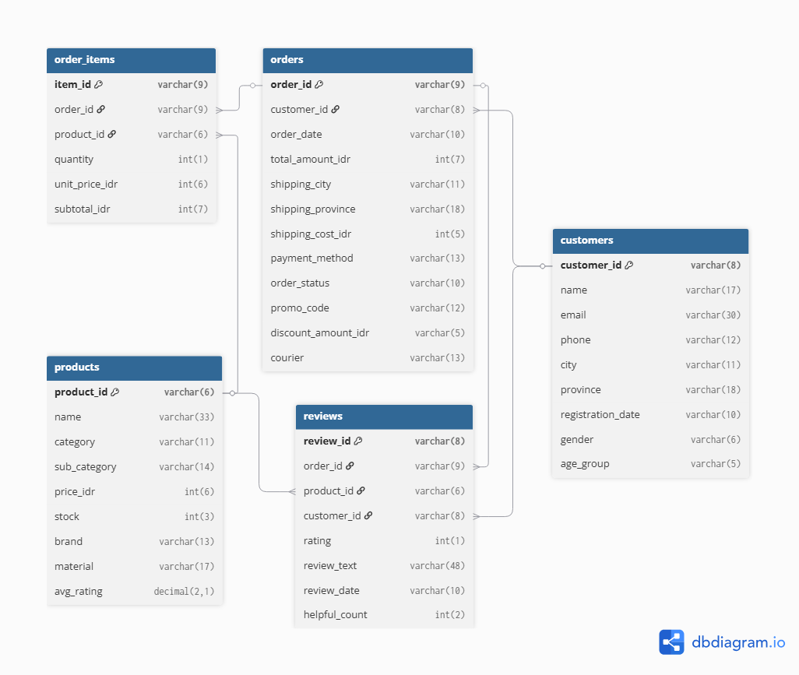
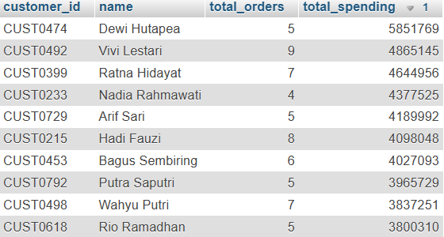
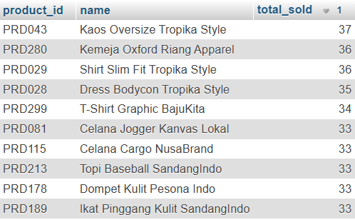
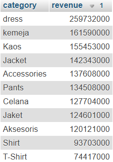
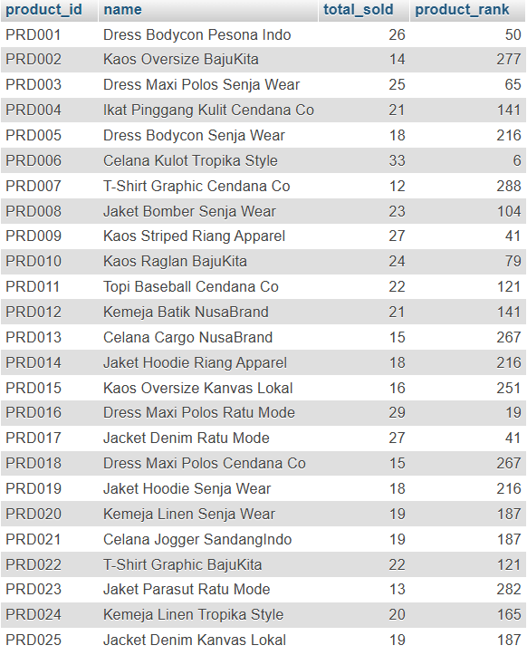

# 🛍️ SQL Analisis Data E-Commerce

Proyek ini merupakan portfolio SQL yang mensimulasikan pekerjaan seorang **Data Analyst** dalam menganalisis database transaksi sebuah toko pakaian online menggunakan **MySQL**.

Analisis dilakukan mulai dari eksplorasi data, validasi kualitas data, analisis bisnis, hingga penggunaan teknik SQL tingkat lanjut seperti **JOIN, Aggregate Function, Subquery, Common Table Expression (CTE),** dan **Window Function**.

---

## 📖 Gambaran Proyek

Sebagai seorang Data Analyst, tugas utama tidak hanya mengambil data, tetapi juga mengubah data transaksi menjadi informasi yang dapat membantu pengambilan keputusan bisnis.

Database yang digunakan terdiri dari lima tabel yang saling berelasi, yaitu data pelanggan, produk, pesanan, detail pesanan, dan ulasan pelanggan.

Melalui proyek ini dilakukan beberapa tahapan analisis, antara lain:

- Eksplorasi struktur dan isi dataset
- Validasi kualitas data
- Analisis penjualan menggunakan SQL
- Analisis perilaku pelanggan
- Analisis performa produk
- Penerapan SQL tingkat lanjut

---

## 📊 Dataset

| Tabel | Jumlah Data |
|--------|------------:|
| Customers | 800 |
| Products | 300 |
| Orders | 3.000 |
| Order Items | 4.986 |
| Reviews | 1.500 |

**Total Data : 10.586 baris**

---

## 🗂 Struktur Database

### Entity Relationship Diagram (ERD)



---

## 🛠 Teknologi yang Digunakan

- MySQL
- phpMyAdmin
- SQL
- Git
- GitHub

---

## 📂 Struktur Repository

```text
Ecommerce-SQL-Portfolio/
│
├── dataset/
│   ├── customers.csv
│   ├── products.csv
│   ├── orders.csv
│   ├── order_items.csv
│   └── reviews.csv
│
├── database/
│   └── ecommerce.sql
│
├── queries/
│   ├── 01_data_preparation.sql
│   ├── 02_business_analysis.sql
│   └── 03_advanced_sql.sql
│
├── images/
│
└── README.md
```

---

## 📑 Analisis SQL

| File | Deskripsi |
|------|-----------|
| 01_data_preparation.sql | Eksplorasi data dan validasi kualitas data |
| 02_business_analysis.sql | Analisis bisnis menggunakan SQL |
| 03_advanced_sql.sql | CTE, Subquery, Window Function, dan Ranking |

---

## 📈 Pertanyaan Bisnis

Beberapa pertanyaan bisnis yang dijawab pada proyek ini antara lain:

- Berapa total pendapatan yang diperoleh perusahaan?
- Siapa pelanggan dengan nilai transaksi terbesar?
- Produk apa yang paling banyak terjual?
- Kategori produk mana yang menghasilkan pendapatan terbesar?
- Kota mana yang memberikan kontribusi penjualan tertinggi?
- Produk apa yang memiliki rating tinggi tetapi penjualannya masih rendah?
- Siapa saja pelanggan yang melakukan pembelian berulang?

---

## 📷 Hasil Analisis

### Top 10 Pelanggan Berdasarkan Total Transaksi



---

### Top 10 Produk Terlaris



---

### Pendapatan Berdasarkan Kategori Produk



---

### Peringkat Produk Terlaris



---

## 💡 Insight Bisnis

Berdasarkan hasil analisis SQL, diperoleh beberapa insight berikut:

- Total pendapatan berasal dari transaksi yang telah selesai (*Delivered*).
- Sebagian kecil pelanggan memberikan kontribusi yang cukup besar terhadap total penjualan.
- Beberapa kategori produk memberikan kontribusi pendapatan lebih tinggi dibanding kategori lainnya.
- Masih terdapat produk dengan rating tinggi namun jumlah penjualannya relatif rendah sehingga berpotensi ditingkatkan melalui promosi.
- Analisis kota tujuan pengiriman dapat digunakan sebagai dasar penyusunan strategi pemasaran berdasarkan wilayah.

---

## 🚀 Cara Menjalankan Proyek

1. Clone repository ini.
2. Import file `database/ecommerce.sql` ke MySQL atau phpMyAdmin.
3. Jalankan query pada folder `queries`.
4. Bandingkan hasil query dengan dokumentasi yang tersedia pada README.

---

## 👨‍💻 Penulis

**Ahmad Supandi**

- GitHub : https://github.com/username
- LinkedIn : https://linkedin.com/in/username
